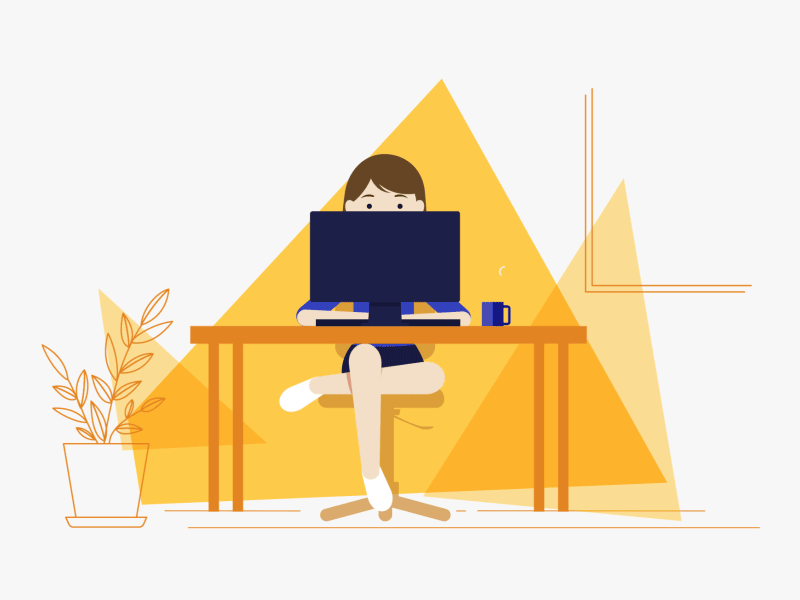
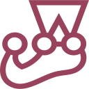

<h1 align="center"><👋 Hi, I'm Kate /></h1>

📍 I am from Belarus, currently located in Georgia.

📚 I study the relevant literature, take courses, master new technologies, and level up my English.

🛠️ My engineering background and BIM technology help in better understanding of the logic and process of creating code.

🎨✨ Drawing and photography skills allow me to better understand the aesthetic, to achieve contact with the user.

🧠 The more knowledge I get, the closer I get to becoming a coding master. Or at least, that's the plan! 🚀

📩 So, send your offers and internships - I'm all ears. 📩

 

  
  
  
  
   
   

 

<h3>🛠️ The tech stack I've worked with in my job</h3>

&nbsp; 
&nbsp; 
&nbsp; 
&nbsp; 
&nbsp; 
&nbsp; 
&nbsp; 
&nbsp; 
&nbsp; 
&nbsp; 
&nbsp; 
&nbsp; 
&nbsp; 
&nbsp; 
&nbsp; 

<h3>🧑‍🎓 Technologies that I’m currently learning</h3>

&nbsp;

<h3>💻 My projects</h3>
<table>
  <tbody>
   <tr>
     <tr>
      <td colspan="2">
        <h3 align="center">Seagull</h3>
      </td>
    </tr>
    <tr>
      <td rowspan="3" width="50%">
        
      </td>
    </tr>
    <tr>
      <td>
        

          
          
          
          
          
          
          
        

      </td>
    </tr>
    <tr>
      <td>
        
<b>About project</b>

        

          📰 An e-commerce SPA application for selling tours and more is built on the <a href="https://docs.commercetools.com/api/">Commercetools API</a>. The application was written in a team of 3 people, my role is Team Lead. I organized team work (GitHub Projects), conducted code reviews, and also participated in writing application code. The following pages are available - Home, Catalog, Cart, Profile, About, Basket, Contact, News. Implemented: Registration, Authorization, Maintaining a session, Editing a user profile, Adding a product to the cart, Basic functionality of the Cart, Applying promotional codes, infinite-scroll, modal windows, toasts, error handling when accessing the API. 
        

        

          <a href="https://github.com/KaterinaMysl/eCommerce_Application" title="Go to the repository">More →</a>
        

      </td>
    </tr>
  </tr>
  <tr>
      <td colspan="2">
        <h3 align="center">CSS-Selectors</h3>
      </td>
    </tr>
    <tr>
      <td rowspan="3" width="50%">
        
      </td>
    </tr>
    <tr>
      <td>
        

          
          
          
          
          
          
        

      </td>
    </tr>
    <tr>
      <td>
        
<b>About project</b>

        

          🎓 The project was completed while studying at <a href="https://rs.school/">RS School</a>. A simulator for learning CSS selectors in the topic of a photographer's routine. 📸 The simulator consists of several game levels. Each level includes a layout example and html code that corresponds to the current level. Some layout elements are highlighted using animation. The user's task is to write a CSS selector that matches all selected layout elements. The application takes into account adaptability, the ability to save progress and reset. 📱
        

        

          <a href="https://github.com/KaterinaMysl/RSS-CSS-Selectors" title="Go to the repository">More →</a>
        

      </td>
    </tr>
        </tr>
        <tr>
      <td colspan="2">
        <h3 align="center">Async race</h3>
      </td>
    </tr>
    <tr>
      <td rowspan="3" width="50%">
        
      </td>
    </tr>
    <tr>
      <td>
        

          
          
          
          
          
        

      </td>
    </tr>
    <tr>
      <td>
        
<b>About project</b>

        

          🚗The project was completed while studying at <a href="https://rs.school/">RS School</a>. Kind of drag-racing competition. Each radio controller has an HTTP-compatible interface. It allows you to start or stop the car's engine and, of course, enable the "drive" mode. SPA, which will manage the collection of cars, control their engines and display race statistics. Key skills: Communication with a server (fetch, REST API), Async coding/Promises, JS Animations, DOM API.
        

        

          <a href="https://github.com/KaterinaMysl/Race" title="Go to the repository">More →</a>
        

      </td>
    </tr>
        </tr>
      <td colspan="2">
        <h3 align="center">Minesweeper</h3>
      </td>
    </tr>
    <tr>
      <td rowspan="3" width="50%">
        
      </td>
    </tr>
    <tr>
      <td>
        

          
          
          
          
        

      </td>
    </tr>
    <tr>
      <td>
        
<b>About project</b>

        

          💥 The project was completed while studying at <a href="https://rs.school/">RS School</a>. The base game Minesweeper, the main functionality of the game is implemented: three field sizes with a user choice of the number of mines, opening cells (empty, numbers, mines), recursive opening of empty cells, color coding for cells with numbers. Additional functionality: dark/ligth theme, list of the last 10 victories (saving in LocalStorage), saving the game state when rebooting (saving in LocalStorage).
        

        

          <a href="https://github.com/KaterinaMysl/minesweeper" title="Go to the repository">More →</a>
        

      </td>
    </tr>
        <tr>
      <td colspan="2">
        <h3 align="center">Shelter</h3>
      </td>
    </tr>
    <tr>
      <td rowspan="3" width="50%">
        
      </td>
    </tr>
    <tr>
      <td>
        

          
          
          
        

      </td>
    </tr>
    <tr>
      <td>
        
<b>About project</b>

        

          🐶 The project was completed while studying at <a href="https://rs.school/">RS School</a>. The animal shelter website consists of 2 pages. It has a valid, semantic, adaptive layout (using BEM, PixelPerfect methodology). The functionality of a mobile menu, slider, page with pagination, and popup has been implemented.
        

        

          <a href="https://github.com/KaterinaMysl/shelter" title="Go to the repository">More →</a>
        

      </td>
    </tr>
        </tr>
        <tr>
      <td colspan="2">
        <h3 align="center">Keyboard</h3>
      </td>
    </tr>
    <tr>
      <td rowspan="3" width="50%">
        
      </td>
    </tr>
    <tr>
      <td>
        

          
          
          
          
        

      </td>
    </tr>
    <tr>
      <td>
        
<b>About project</b>

        

          ⌨️ The project was completed while studying at <a href="https://rs.school/">RS School</a>. The keyboard performs functionality both physical and on-screen, and is accompanied by key animation. Also implemented is changing day and night modes and selecting a custom color.
        

        

          <a href="https://github.com/KaterinaMysl/virtual-keyboard" title="Go to the repository">More →</a>
        

      </td>
    </tr>
        </tr>
</tbody>
</table>

---

 

